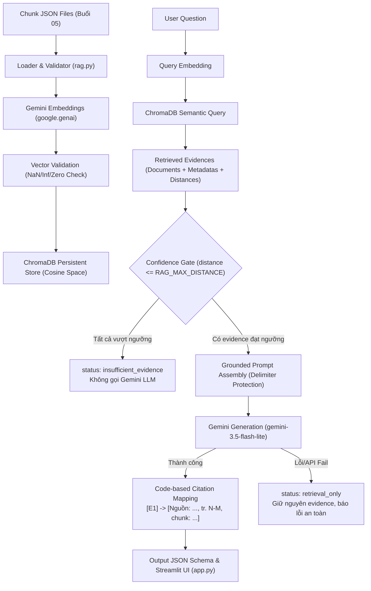

# Buổi 07: RAG Pipeline System - Semantic Index, Grounding & Citation Mapping

## 1. Mục tiêu
Dự án Buổi 07 xây dựng một hệ thống RAG (Retrieval-Augmented Generation) hoàn chỉnh từ đầu đến cuối (End-to-End) dành cho người mới học, bao gồm:
- **Loader & Validator**: Đọc và kiểm tra nghiêm ngặt dữ liệu chunk JSON.
- **Semantic Embedding**: Sinh vector embedding bằng Gemini API (`google.genai`).
- **Vector Storage**: Lưu trữ và quản lý chỉ mục persistent bằng ChromaDB.
- **Semantic Retrieval**: Truy xuất đoạn văn bản tương đồng theo khoảng cách Cosine.
- **Confidence Gate**: Lọc ngưỡng tin cậy để loại bỏ trích dẫn không liên quan trước khi gọi LLM.
- **Grounded Generation**: Tổng hợp câu trả lời dựa trên trích dẫn hợp lệ.
- **Citation Mapping**: Ánh xạ mã nhãn `[E1]` sang thông tin nguồn thật (`[Nguồn: ..., tr. N-M, chunk: ...]`) hoàn toàn bằng code Python.
- **Streamlit UI**: Giao diện trực quan cho người dùng tương tác, kiểm tra trạng thái và truy vấn.

---

## 2. Mối quan hệ với Buổi 05 và Buổi 06
- **Buổi 05**: Nguồn dữ liệu chunks chuẩn hóa đầu vào (`rag_foundation/buoi_05/output/chunks/`) và môi trường ảo Python (`rag_foundation/buoi_05/.venv/`). Buổi 07 **tái sử dụng hoàn toàn** `.venv` và dữ liệu chunks của Buổi 05 mà không chỉnh sửa bất kỳ code/output nào của Buổi 05.
- **Buổi 06**: Tài liệu tham khảo dự án RAG trước đó. Buổi 07 hoạt động độc lập và không can thiệp hay sửa đổi tài nguyên Buổi 06.

---

## 3. Sơ đồ RAG Pipeline


---

## 4. Cấu trúc thư mục Buổi 07
```text
rag_foundation/buoi_07/
├── SPEC_buoi_07.md             # Agent Specification & System Contract
├── README.md                   # Tài liệu hướng dẫn sử dụng chi tiết
├── rag.py                      # Core Module: Loader, Embedding, ChromaDB Index & RAG Query Pipeline
├── app.py                      # Streamlit Web UI Application
├── requirements.txt            # Danh sách dependencies trực tiếp của Buổi 07
├── .env.example                # Mẫu cấu hình biến môi trường
├── .env                        # File cấu hình biến môi trường thực tế (bị gitignore)
├── .gitignore                  # Cấu hình bỏ qua .env, storage/chroma/, __pycache__
├── tests/
│   ├── __init__.py             # Test package initializer
│   ├── test_rag.py             # Bộ 35 unit test tự động phủ 47 điều kiện
│   └── fixtures/
│       └── chunks_sample.json  # Dữ liệu chunk mẫu dùng cho testing
└── storage/
    ├── .gitkeep                # Giữ cấu trúc thư mục storage trong git
    └── chroma/                 # ChromaDB Persistent Storage (chứa vector index)
```

---

## 5. Điều kiện đầu vào
1. Thư mục dữ liệu `rag_foundation/buoi_05/output/chunks/` chứa các file JSON chunk (`chunks_fixed.json`, `chunks_hierarchical.json`, `chunks_semantic.json`).
2. Môi trường Python 3.11+ (khuyên dùng `.venv` tại `rag_foundation/buoi_05/.venv/`).

---

## 6. Hướng dẫn sử dụng `.venv` Buổi 05
Hệ thống tận dụng môi trường ảo có sẵn của Buổi 05.
- **Windows PowerShell**: `.\rag_foundation\buoi_05\.venv\Scripts\python.exe`
- **Linux/macOS**: `./rag_foundation/buoi_05/.venv/bin/python`

---

## 7. Cài đặt Requirements
Chạy lệnh cài đặt gói phụ thuộc vào venv Buổi 05:

**Windows PowerShell**:
```powershell
.\rag_foundation\buoi_05\.venv\Scripts\python.exe -m pip install -r .\rag_foundation\buoi_07\requirements.txt
```

**Linux/macOS**:
```bash
./rag_foundation/buoi_05/.venv/bin/python -m pip install -r ./rag_foundation/buoi_07/requirements.txt
```

---

## 8. Tạo file `.env` từ `.env.example`
Sao chép `.env.example` thành `.env` tại thư mục `rag_foundation/buoi_07/`:

**Windows PowerShell**:
```powershell
Copy-Item .\rag_foundation\buoi_07\.env.example -Destination .\rag_foundation\buoi_07\.env
```

**Linux/macOS**:
```bash
cp ./rag_foundation/buoi_07/.env.example ./rag_foundation/buoi_07/.env
```

---

## 9. Giải thích các biến môi trường trong `.env`
- `GEMINI_API_KEY`: API Key của Google Gemini API. (Chừa rỗng nếu chỉ chạy validate/status hoặc unit test).
- `GEMINI_EMBEDDING_MODEL`: Tên model sinh vector (Mặc định: `gemini-embedding-2`).
- `GEMINI_EMBEDDING_DIM`: Số chiều của vector embedding (Mặc định: `768`, chấp nhận từ `128` đến `3072`).
- `GEMINI_GENERATION_MODEL`: Tên model tổng hợp câu trả lời (Mặc định: `gemini-3.5-flash-lite`).
- `DEFAULT_TOP_K`: Số lượng đoạn trích dẫn mặc định cần truy xuất (Mặc định: `5`, từ `1` đến `20`).
- `RAG_MAX_DISTANCE`: Ngưỡng khoảng cách Cosine tối đa để lọc trích dẫn (Mặc định: `0.45`).

---

## 10 - 16. Các Lệnh Thực Thi Hệ Thống

> **Lưu ý**: Chạy các lệnh dưới đây tại thư mục gốc `RAG` (thư mục chứa trực tiếp `rag_foundation/`).

### 10. Lệnh Validate dữ liệu
Kiểm tra tính hợp lệ của các file chunk JSON trong `buoi_05/output/chunks/`:
- **Windows**: `.\rag_foundation\buoi_05\.venv\Scripts\python.exe .\rag_foundation\buoi_07\rag.py validate --strategy hierarchical`
- **Linux/macOS**: `./rag_foundation/buoi_05/.venv/bin/python ./rag_foundation/buoi_07/rag.py validate --strategy hierarchical`

### 11. Lệnh Status (Read-only)
Kiểm tra cấu hình môi trường và trạng thái collection trong ChromaDB:
- **Windows**: `.\rag_foundation\buoi_05\.venv\Scripts\python.exe .\rag_foundation\buoi_07\rag.py status --strategy hierarchical`
- **Linux/macOS**: `./rag_foundation/buoi_05/.venv/bin/python ./rag_foundation/buoi_07/rag.py status --strategy hierarchical`

### 12. Lệnh Index dữ liệu
Sinh vector embedding bằng Gemini API và lập chỉ mục vào ChromaDB:
- **Windows**: `.\rag_foundation\buoi_05\.venv\Scripts\python.exe .\rag_foundation\buoi_07\rag.py index --strategy hierarchical`
- **Linux/macOS**: `./rag_foundation/buoi_05/.venv/bin/python ./rag_foundation/buoi_07/rag.py index --strategy hierarchical`

### 13. Lệnh Reset Collection và Index lại
Xóa sạch riêng collection đích của strategy được chọn và lập chỉ mục mới:
- **Windows**: `.\rag_foundation\buoi_05\.venv\Scripts\python.exe .\rag_foundation\buoi_07\rag.py index --strategy hierarchical --reset`
- **Linux/macOS**: `./rag_foundation/buoi_05/.venv/bin/python ./rag_foundation/buoi_07/rag.py index --strategy hierarchical --reset`

### 14. Lệnh Query CLI
Thực hiện truy vấn hỏi đáp với pipeline RAG:
- **Windows**: `.\rag_foundation\buoi_05\.venv\Scripts\python.exe .\rag_foundation\buoi_07\rag.py query --strategy hierarchical --top-k 5 --question "Cơ cấu lại thời hạn trả nợ được quy định như thế nào?"`
- **Linux/macOS**: `./rag_foundation/buoi_05/.venv/bin/python ./rag_foundation/buoi_07/rag.py query --strategy hierarchical --top-k 5 --question "Cơ cấu lại thời hạn trả nợ được quy định như thế nào?"`

### 15. Lệnh Chạy Automated Unit Tests (Offline)
Chạy toàn bộ 35 unit test tự động phủ 47 điều kiện nghiệp vụ mà không gọi Internet hay API key thật:
- **Windows**: `.\rag_foundation\buoi_05\.venv\Scripts\python.exe -m unittest discover -s .\rag_foundation\buoi_07\tests -v`
- **Linux/macOS**: `./rag_foundation/buoi_05/.venv/bin/python -m unittest discover -s ./rag_foundation/buoi_07/tests -v`

### 16. Lệnh Khởi chạy Streamlit Web UI
- **Windows**: `.\rag_foundation\buoi_05\.venv\Scripts\python.exe -m streamlit run .\rag_foundation\buoi_07\app.py`
- **Linux/macOS**: `./rag_foundation/buoi_05/.venv/bin/python -m streamlit run ./rag_foundation/buoi_07/app.py`

---

## 17. Khái niệm và Thuật ngữ Kỹ thuật
- **Strategy**: Chiến lược cắt chunk văn bản (`hierarchical`, `semantic`, `fixed-size`). Mỗi strategy được quản lý ở một collection ChromaDB độc lập.
- **Embedding Model & Dimension**: Model trí tuệ nhân tạo dùng để mã hóa văn bản thành vector số (vd: `gemini-embedding-2` với `768` chiều).
- **Collection Identity**: Quy tắc định danh duy nhất cho collection ChromaDB dạng `nhnn-<strategy>-<dimension>-<model_hash>`, lưu kèm metadata để kiểm tra chống xung đột cấu hình.
- **Top-K**: Số lượng trích dẫn có điểm tương đồng cao nhất được truy xuất từ Vector Database.
- **Cosine Distance**: Khoảng cách đo độ sai biệt giữa 2 vector. Khoảng cách càng nhỏ (gần `0.0`), độ tương đồng ngữ nghĩa càng cao.
- **RAG_MAX_DISTANCE & Confidence Gate**: Ngưỡng khoảng cách tối đa để chấp nhận một đoạn trích dẫn. Các trích dẫn có distance > `RAG_MAX_DISTANCE` bị Confidence Gate loại bỏ khỏi prompt gửi cho LLM.
- **Retrieval-Only**: Trạng thái khi hệ thống truy xuất được dữ liệu nhưng quá trình sinh câu trả lời tự động bằng Gemini bị lỗi hoặc bị gián đoạn.
- **Citation Mapping**: Quá trình mã nguồn Python tự động dò tìm nhãn `[E1]`, `[E2]` do LLM tạo ra và thay thế bằng thông tin trích dẫn nguồn thực tế `[Nguồn: ..., tr. N-M, chunk: ...]`.

---

## 18. Cách Dừng Ứng Dụng Streamlit
Khi muốn dừng server Streamlit đang chạy trong terminal, hãy nhấn tổ hợp phím **`Ctrl + C`**.

---

## 19. Hướng Dẫn Xử Lý Lỗi Thường Gặp (Troubleshooting)
1. **Thiếu Package / ModuleNotFoundError**: Chạy lại lệnh cài đặt requirements ở Mục 7 bằng đúng interpreter venv.
2. **Sai Interpreter**: Kiểm tra đường dẫn python đang dùng phải trỏ về `.venv/Scripts/python.exe` (Windows) hoặc `.venv/bin/python` (Linux/macOS).
3. **Lỗi Thiếu API Key**: Mở file `.env` và điền `GEMINI_API_KEY=<KEY_CỦA_BẠN>`.
4. **Collection rỗng hoặc chưa tồn tại**: Chạy lệnh `index` trước khi thực hiện `query`.
5. **Model/Dimension Mismatch**: Xảy ra khi thay đổi model hoặc dimension trong `.env`. Chạy lệnh `index` kèm tham số `--reset`.
6. **Lỗi JSON / Record không hợp lệ**: Chạy lệnh `validate` để xem chi tiết file và vị trí record bị lỗi.
7. **Lỗi Rate Limit / Quota Gemini API**: Chờ ít phút trước khi thử lại hoặc giảm số lượng chunk index.

---

## 20. Giới Hạn Của Ứng Dụng Demo
- Ứng dụng tập trung vào bản chất RAG pipeline cơ bản phục vụ giảng dạy.
- Chưa hỗ trợ Reranker, Hybrid Search (BM25 + Vector), OCR nâng cao hay quản lý phiên người dùng (Multi-turn chat).

---

## 21. Cảnh Báo An Toàn & Bảo Mật
- **Không Phải Tư Vấn Pháp Lý**: Kết quả trả lời của AI chỉ mang tính chất tham khảo dựa trên dữ liệu mẫu được cung cấp, không thay thế cho văn bản pháp lý chính thức.
- **Cần Hiệu Chỉnh Ngưỡng**: Giá trị `RAG_MAX_DISTANCE = 0.45` là ngưỡng thử nghiệm. Tùy thuộc vào bộ dữ liệu cụ thể, người vận hành cần hiệu chỉnh ngưỡng này.
- **Khả Năng Bỏ Sót**: Phương pháp Semantic Search có thể bỏ sót thông tin nếu câu hỏi dùng từ khóa khác biệt hoàn toàn với văn bản gốc.
- **Bảo Mật Dữ Liệu**: Khi gọi API Gemini Embedding và Generation, nội dung chunk sẽ được gửi tới dịch vụ Google Cloud API. Chỉ sử dụng dữ liệu được phép gửi tới bên thứ ba.

---

## 22. Kế Hoạch Kiểm Thử Thủ Công (Manual Test Plan)

Dưới đây là 3 câu hỏi kiểm thử thủ công để đánh giá hiệu quả của hệ thống sau khi đã index dữ liệu thật (`strategy: hierarchical`):

### Câu hỏi A (Trong phạm vi tài liệu mẫu):
> **Câu hỏi**: `Cơ cấu lại thời hạn trả nợ được quy định như thế nào?`
> - **Kỳ vọng**: Truy xuất được các chunk liên quan đến quy định cơ cấu thời hạn trả nợ. Nếu đạt threshold, hệ thống tổng hợp câu trả lời kèm trích dẫn `[Nguồn: ..., tr. N, chunk: ...]`.

### Câu hỏi B (Trong phạm vi tài liệu mẫu):
> **Câu hỏi**: `Việc phân loại nợ và trích lập dự phòng được thực hiện như thế nào?`
> - **Kỳ vọng**: Tìm thấy các trích dẫn về phân loại nợ/dự phòng rủi ro. Nếu tài liệu mẫu chưa đề cập đầy đủ, Confidence Gate có thể loại bớt evidence yếu hoặc thông báo không đủ thông tin.

### Câu hỏi C (Ngoài phạm vi tài liệu):
> **Câu hỏi**: `Ngân hàng nào có lãi suất tiết kiệm cao nhất hôm nay?`
> - **Kỳ vọng mong muốn**: Không có trích dẫn nào trong tài liệu mẫu khớp với câu hỏi này. Các evidence truy xuất ra sẽ có khoảng cách Cosine rất lớn (exceed `RAG_MAX_DISTANCE`). Confidence Gate kích hoạt, trạng thái chuyển thành `insufficient_evidence`, **không gọi Gemini Generation** và trả về thông báo: `"Không tìm thấy đủ thông tin liên quan trong tài liệu đã cung cấp."` (Không được bịa đặt tên ngân hàng hay lãi suất).
