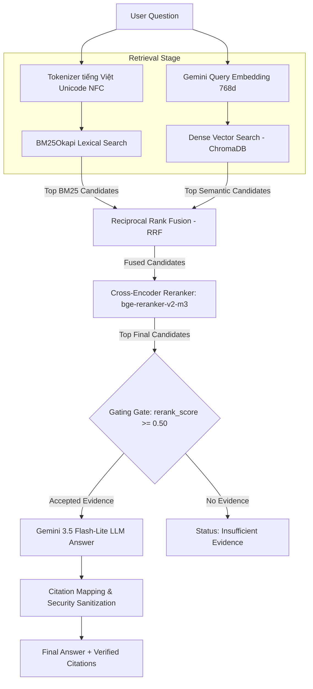

# Advanced RAG System — Legal Document Search & QA (Buổi 08)

---

## 1. Mục Tiêu & Khác Biệt Giữa Buổi 07 và Buổi 08

Buổi 07 tập trung xây dựng baseline **Dense Semantic Vector Retrieval** với Google Gemini Embeddings và ChromaDB. Tuy nhiên, tìm kiếm theo không gian vector đơn thuần thường gặp hạn chế với văn bản pháp lý tiếng Việt khi cần bắt chính xác các số hiệu điều/khoản, thuật ngữ tra cứu chuyên ngành hoặc từ khóa cụ thể.

**Buổi 08 nâng cấp thành hệ thống Advanced RAG hoàn chỉnh với 4 tầng xử lý:**
1. **Lexical Keyword Retrieval (BM25Okapi)**: Bảo toàn từ khóa chính xác, số Điều/Khoản và thuật ngữ pháp lý.
2. **Dense Semantic Retrieval (Gemini Embedding 2 + ChromaDB)**: Truy xuất ngữ nghĩa thông minh cho các câu hỏi diễn đạt lại (paraphrase).
3. **Reciprocal Rank Fusion (RRF)**: Dung hợp không phụ thuộc thang đo điểm (scale-agnostic) giữa kết quả Lexical và Semantic.
4. **Multilingual Cross-Encoder Reranker (`BAAI/bge-reranker-v2-m3`)**: Đọc đồng thời cặp `(câu hỏi, đoạn văn bản)` để chấm điểm tương quan thực tế và tái xếp hạng candidates.

---

## 2. Sơ Đồ Kiến Trúc Hệ Thống Advanced RAG



---

## 3. Cấu Trúc Thư Mục Project `rag_foundation/buoi_08/`

```text
rag_foundation/buoi_08/
├── SPEC_buoi_08.md             # Specification & System Contracts chi tiết
├── README.md                   # Tài liệu hướng dẫn chi tiết dự án Buổi 08
├── requirements.txt            # Danh sách dependencies trực tiếp
├── .env.example                # Mẫu biến môi trường cấu hình Advanced RAG
├── .gitignore                  # Gitignore dành riêng Buổi 08 (bỏ qua .env, storage, reports)
├── rag.py                      # Baseline Semantic RAG module (sao chép độc lập từ Buổi 07)
├── advanced_rag.py             # Core Advanced RAG Module (BM25, Semantic, RRF, Reranker, Query, Compare)
├── evaluate.py                 # Evaluation Framework (Recall@K, MRR@K, nDCG@K, Latency P50)
├── app.py                      # Streamlit Multi-tab Comparison & Trace Dashboard
├── eval/
│   └── questions.json          # Bộ dữ liệu câu hỏi đánh giá kèm ground-truth
├── tests/
│   ├── __init__.py
│   ├── test_bm25.py            # Unit tests cho Tokenizer & BM25 Search
│   ├── test_semantic.py        # Unit tests cho Semantic Candidate Search & Status
│   ├── test_fusion.py          # Unit tests cho Reciprocal Rank Fusion & Trace
│   ├── test_reranker.py        # Unit tests cho Cross-Encoder Reranker
│   ├── test_pipeline.py        # Unit tests cho Answer Pipeline, Gating & Citations
│   ├── test_evaluator.py       # Unit tests cho chỉ số đánh giá Metrics tính tay
│   └── test_isolation.py       # Unit tests cho System Isolation & Resource Protection
├── reports/                    # Thư mục lưu kết quả đánh giá dạng JSON
└── storage/                    # Persistent storage (chromaDB & huggingface model cache)
```

---

## 4. Hướng Dẫn Cài Đặt & Cấu Hình Môi Trường

### 4.1. Môi Trường Virtualenv & Dependencies
Hệ thống tái sử dụng môi trường virtualenv của `buoi_05`:
```powershell
# Cài đặt toàn bộ dependencies bắt buộc
.\rag_foundation\buoi_05\.venv\Scripts\python.exe -m pip install -r .\rag_foundation\buoi_08\requirements.txt
```

### 4.2. Khởi Tạo File Cấu Hình `.env`
Sao chép `.env.example` thành `.env` trong thư mục `rag_foundation/buoi_08/` và điền `GEMINI_API_KEY`:
```ini
GEMINI_API_KEY=your_real_gemini_api_key_here
GEMINI_EMBEDDING_MODEL=gemini-embedding-2
GEMINI_EMBEDDING_DIM=768
GEMINI_GENERATION_MODEL=gemini-3.5-flash-lite
RAG_MAX_DISTANCE=0.45
BM25_CANDIDATES=20
SEMANTIC_CANDIDATES=20
RRF_K=60
RRF_BM25_WEIGHT=1.0
RRF_SEMANTIC_WEIGHT=1.0
RERANK_CANDIDATES=20
FINAL_TOP_K=5
RERANKER_MODEL=BAAI/bge-reranker-v2-m3
RERANKER_MAX_LENGTH=512
RERANK_BATCH_SIZE=4
RERANK_MIN_SCORE=0.50
RERANK_DEVICE=auto
```

---

## 5. Cảnh Báo Tài Nguyên & Kích Thước Mô Hình Reranker

> [!WARNING]
> Mô hình Cross-Encoder `BAAI/bge-reranker-v2-m3` có dung lượng khoảng **2.2GB**.
> Khi chạy các lệnh sử dụng reranker (`rerank`, `query --mode hybrid_rerank`), hệ thống sẽ tải mô hình về lưu tại thư mục `rag_foundation/buoi_08/storage/huggingface/`.
> Cần đảm bảo hệ thống có kết nối Internet ổn định, ít nhất 3GB dung lượng ổ cứng trống và tối thiểu 4GB RAM khả dụng.

---

## 6. Hướng Dẫn Các Lệnh CLI Chẩn Đoán & Thực Thi

Tất cả các lệnh được chạy từ thư mục gốc `RAG`.

### 6.1. Lệnh Status (Read-Only)
```powershell
.\rag_foundation\buoi_05\.venv\Scripts\python.exe .\rag_foundation\buoi_08\advanced_rag.py status --strategy hierarchical
```

### 6.2. Lệnh Lập Chỉ Mục Semantic Index (`prepare-semantic`)
```powershell
.\rag_foundation\buoi_05\.venv\Scripts\python.exe .\rag_foundation\buoi_08\advanced_rag.py prepare-semantic --strategy hierarchical
```

### 6.3. Chẩn Đoán Lexical BM25 Search
```powershell
.\rag_foundation\buoi_05\.venv\Scripts\python.exe .\rag_foundation\buoi_08\advanced_rag.py bm25 --strategy hierarchical --question "Điều 7 quy định gì?"
```

### 6.4. Chẩn Đoán Semantic Search
```powershell
.\rag_foundation\buoi_05\.venv\Scripts\python.exe .\rag_foundation\buoi_08\advanced_rag.py semantic --strategy hierarchical --question "Điều 7 quy định gì?"
```

### 6.5. Chẩn Đoán Hybrid Search & RRF Fusion
```powershell
.\rag_foundation\buoi_05\.venv\Scripts\python.exe .\rag_foundation\buoi_08\advanced_rag.py hybrid --strategy hierarchical --question "Điều 7 quy định gì?"
```

### 6.6. Chẩn Đoán Cross-Encoder Reranker
```powershell
.\rag_foundation\buoi_05\.venv\Scripts\python.exe .\rag_foundation\buoi_08\advanced_rag.py rerank --strategy hierarchical --question "Điều 7 quy định gì?"
```

### 6.7. Truy Vấn Advanced RAG Sinh Câu Trả Lời (`query`)
```powershell
.\rag_foundation\buoi_05\.venv\Scripts\python.exe .\rag_foundation\buoi_08\advanced_rag.py query --mode hybrid_rerank --strategy hierarchical --question "Điều 7 quy định gì?"
```

### 6.8. So Sánh Thứ Hạng Retrieval 4 Modes (`compare` - Không phát sinh LLM Generation)
```powershell
.\rag_foundation\buoi_05\.venv\Scripts\python.exe .\rag_foundation\buoi_08\advanced_rag.py compare --strategy hierarchical --question "Điều 7 quy định gì?"
```

---

## 7. Lệnh Chạy Testing, Evaluation & Streamlit UI

### 7.1. Chạy Toàn Bộ Unit Test Suite (Offline 100%)
```powershell
.\rag_foundation\buoi_05\.venv\Scripts\python.exe -m unittest discover -s .\rag_foundation\buoi_08\tests -v
```

### 7.2. Chạy Benchmark Đánh Giá Hiệu Năng (`evaluate.py`)
```powershell
.\rag_foundation\buoi_05\.venv\Scripts\python.exe .\rag_foundation\buoi_08\evaluate.py --strategy hierarchical --k 5
```

### 7.3. Khởi Chạy Streamlit Dashboard UI (`app.py`)
```powershell
.\rag_foundation\buoi_05\.venv\Scripts\python.exe -m streamlit run .\rag_foundation\buoi_08\app.py
```

---

## 8. Giải Thích Ý Nghĩa Thang Đo & Điểm Số

1. **BM25 Score**: Điểm trùng khớp từ khóa raw. Điểm càng cao biểu thị mức độ xuất hiện từ khóa trong chunk càng dày đặc (không giới hạn trên).
2. **Cosine Distance**: Khoảng cách vector giữa query và document embedding. Khoảng cách càng gần `0.0` càng đồng nghĩa ngữ nghĩa.
3. **RRF Score**: Điểm dung hợp thứ hạng $w / (k + \text{rank})$. RRF giải quyết bài toán không cùng thang đo giữa BM25 score và Cosine distance.
4. **Rerank Score**: Điểm Sigmoid $\sigma(\text{logit}) \in [0.0, 1.0]$ do mô hình Cross-Encoder chấm. Đây là điểm số tương quan đã chuẩn hóa, **không đại diện cho xác suất thống kê tuyệt đối**.

---

## 9. Phân Biệt Candidate K và Final K

- **Candidate K (`BM25_CANDIDATES`, `SEMANTIC_CANDIDATES`, `RERANK_CANDIDATES`)**: Số lượng ứng viên được giữ lại ở các vòng trung gian (mặc định 20) để đảm bảo không bỏ sót thông tin liên quan ở tầng dưới.
- **Final K (`FINAL_TOP_K`)**: Số lượng đoạn thông tin tốt nhất sau cùng (mặc định 5) được chọn để đưa vào bộ lọc Gating và nạp vào prompt cho LLM sinh câu trả lời.

---

## 10. Đánh Giá Metrics & Giới Hạn Gold Labels

- **Recall@K**: Tỷ lệ tìm thấy các chunk liên quan chuẩn trong Top K.
- **MRR@K (Mean Reciprocal Rank)**: Điểm xếp hạng nghịch đảo của chunk liên quan đầu tiên xuất hiện.
- **nDCG@K**: Điểm đánh giá chất lượng xếp hạng có tính đến vị trí thứ hạng của chunk liên quan.

> [!IMPORTANT]
> Khi bộ câu hỏi chứa các mục `needs_human_review=true`, kết quả đánh giá mang tính chất tham khảo kỹ thuật và **chưa tuyên bố mode chiến thắng chính thức** cho đến khi có sự nghiệm thu của chuyên gia domain.

---

## 11. Hướng Dẫn Xử Lý Lỗi (Troubleshooting)

1. **Tải mô hình Reranker bị đứng/lỗi đường truyền**:
   - Kiểm tra kết nối Internet. Đảm bảo biến môi trường `HF_HOME` trỏ tới `storage/huggingface/`.
2. **Chạy CPU bị chậm khi Rerank**:
   - Mặc định device `auto` sẽ dùng CPU nếu không có GPU CUDA. Có thể giảm `RERANK_CANDIDATES` xuống `10` hoặc `5` trong `.env` để tăng tốc độ.
3. **Lỗi thiếu API Key (`GEMINI_API_KEY`)**:
   - Kiểm tra file `.env` đã điền key hợp lệ. Lệnh `status` và bộ test offline sẽ hiển thị thông báo thiếu key rõ ràng mà không gây crash ứng dụng.

---

## 12. Kịch Bản So Sánh Trực Tiếp Thực Tế (Manual Comparison Questions)

A. **Exact Legal Reference**:
   `Điều 7 quy định như thế nào về cơ cấu lại thời hạn trả nợ?`
   *(BM25 và RRF đưa đúng Điều 7 lên top 1)*

B. **Paraphrase Semantic**:
   `Khách hàng gặp khó khăn có thể được điều chỉnh kỳ hạn trả nợ ra sao?`
   *(Semantic và Reranker hỗ trợ bắt đúng ngữ nghĩa ngay cả khi không dùng chính xác từ khóa "Điều 7")*

C. **Multi-Concept**:
   `Phân loại nợ và trích lập dự phòng được thực hiện như thế nào?`
   *(RRF Fusion kết hợp ứng viên từ cả hai nhánh BM25 và Semantic)*

D. **Out-of-Scope**:
   `Ngân hàng nào có lãi suất tiết kiệm cao nhất hôm nay?`
   *(Gating chặn lại và trả về trạng thái `insufficient_evidence`)*

---

## 13. Miễn Trừ Trách Nhiệm Pháp Lý

System này được xây dựng phục vụ mục đích nghiên cứu và thực hành kỹ thuật Advanced RAG. Kết quả truy xuất và câu trả lời của AI **không cấu thành lời khuyên pháp lý chính thức**.
